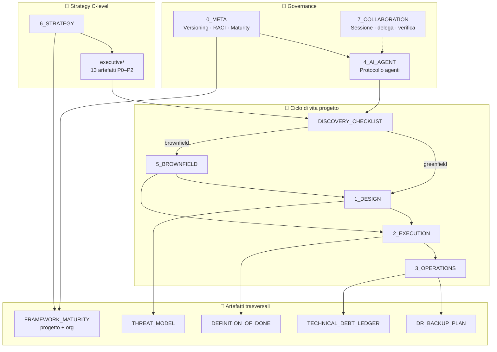
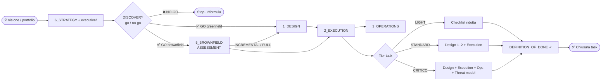
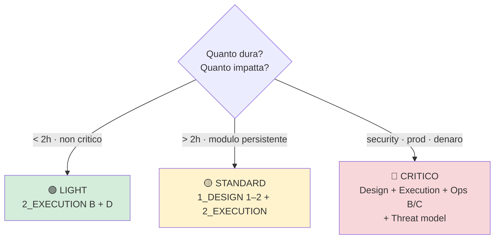
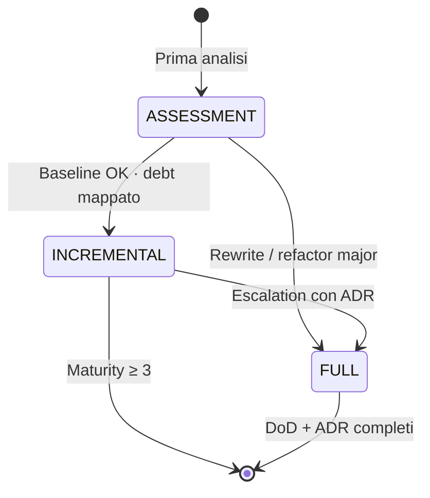

<div align="center">

# 🏗️ Operational Engineering Framework

**Manuale operativo per progettare, eseguire, operare e governare sistemi software** — greenfield e brownfield — con layer **C-level** (`6_STRATEGY`) e protocollo agenti AI.

[](./LICENSE)
[](./0_META_FRAMEWORK.md)
[](./executive/README.md)
[](#-changelog)
[](./FRAMEWORK_MATURITY.md)

[📖 Inizia qui](#-quick-start) · [🎯 Strategy C-level](#-layer-strategico-c-level) · [🗺️ Framework](#-framework-operativi) · [🤝 Collaborazione](./7_COLLABORATION_FRAMEWORK.md) · [❓ FAQ](./FAQ.md) · [🤖 Agenti AI](./AGENTS.md) · [🚨 Runbook](./runbooks/README.md)

</div>

---

## 📋 Indice

- [Cos'è](#-cosè)
- [Per chi è](#-per-chi-è)
- [Layer strategico C-level](#-layer-strategico-c-level)
- [Collaborazione owner-AI](#-collaborazione-owner-ai)
- [Architettura del manuale](#-architettura-del-manuale)
- [Flusso operativo](#-flusso-operativo)
- [Framework operativi](#-framework-operativi)
- [Classificazione task](#-classificazione-task)
- [Brownfield](#-brownfield)
- [Artefatti trasversali](#-artefatti-trasversali)
- [Operazioni e incidenti](#-operazioni-e-incidenti)
- [Agenti AI](#-agenti-ai)
- [Quick start](#-quick-start)
- [Struttura repository](#-struttura-repository)
- [Governance e licenza](#-governance-e-licenza)
- [Changelog](#-changelog)

---

## 🎯 Cos'è

Un **set di documenti operativi** — non un tool — che traduce buone pratiche di ingegneria software in checklist, gate, tier e artefatti riutilizzabili.

| Principio | Descrizione |
|-----------|-------------|
| **Dogfooding** | Il manuale si governa con le proprie regole (`0_META`) |
| **Tier-aware** | Ogni task ha un livello di rigore: LIGHT · STANDARD · CRITICO |
| **Path-aware** | Greenfield e brownfield hanno percorsi distinti ma convergono su Execution e Operations |
| **Strategy-aware** | Portfolio, roadmap, risk e FinOps prima di Discovery (`6_STRATEGY`) |
| **AI-native** | Gli agenti AI seguono un protocollo esplicito (`4_AI_AGENT`) con escalation e DoD |

> 💡 **Non sostituisce** la documentazione del tuo prodotto: fornisce **come** lavorare su design, delivery, ops e legacy in modo coerente.

---

## 👥 Per chi è

| Ruolo | Documenti di ingresso |
|-------|----------------------|
| **CEO / CTO** | `6_STRATEGY` · [executive/](./executive/README.md) · portfolio · risk |
| **Fellow / Principal** | [ENGINEERING_PRINCIPLES](./executive/ENGINEERING_PRINCIPLES.md) · [HORIZON_BETS](./executive/HORIZON_BETS.md) · ARB |
| **Tech lead / architect** | `1_DESIGN` · `5_BROWNFIELD` · ADR |
| **Developer** | `2_EXECUTION` · `DEFINITION_OF_DONE` |
| **SRE / on-call** | `3_OPERATIONS` · `runbooks/` · `DR_BACKUP_PLAN` |
| **Product / stakeholder** | `DISCOVERY_CHECKLIST` · `FRAMEWORK_MATURITY` |
| **Agenti AI (Cursor, ecc.)** | [`AGENTS.md`](./AGENTS.md) → `4_AI_AGENT` |

---

## 🤝 Collaborazione owner-AI

Layer trasversale — non nella catena verticale del ciclo di vita, si applica **attraverso** di essa, a cadenza per-sessione (non per-task).

| | Alias | Documento | Ver. | Quando usarlo |
|---|-------|-----------|:----:|---------------|
| 🤝 | `7_COLLABORATION` | [7_COLLABORATION_FRAMEWORK.md](./7_COLLABORATION_FRAMEWORK.md) | **1.3** | Inizio sessione · working tree condivisa · delega sub-agent · verifica claim propri e di altri agenti AI |

**5 aree**: Session Identity & Handover · Shared Working-Tree & Infra · Delegation & Sub-Agent Discipline · Verification & Trust Boundary · Tool & Permission Friction. Decisione architetturale: [ADR-003.md](./ADR-003.md).

---

## 🧩 Architettura del manuale



---

## 🔀 Flusso operativo



**Regole di chiusura**

- Ogni task passa da **[DEFINITION_OF_DONE](./DEFINITION_OF_DONE.md)** prima del merge o del deploy.
- Review trimestrale con **[FRAMEWORK_MATURITY](./FRAMEWORK_MATURITY.md)** — target minimo **≥ 3** su produzione con utenti reali.

---

## 🎯 Layer strategico C-level

Framework e artefatti per **CEO**, **CTO** e **Fellow** — sopra Discovery, sotto il codice.

| | Alias | Documento | Ver. | Quando usarlo |
|---|-------|-----------|:----:|---------------|
| 🎯 | `6_STRATEGY` | [6_STRATEGY_FRAMEWORK.md](./6_STRATEGY_FRAMEWORK.md) | **1.0** | Portfolio · roadmap · risk · FinOps · org · compliance |

### Tier executive → operativo

| Executive | Orizzonte | Mapping task |
|-----------|-----------|--------------|
| **STRATEGIC** | 6–18 mesi | Alimenta Discovery · business case §2b |
| **TACTICAL** | Quarter | Default **STANDARD** · CRITICO se security/denaro |
| **OPERATIONAL** | Sprint | **LIGHT** / **STANDARD** / **CRITICO** |

### Artefatti [executive/](./executive/README.md)

| Priorità | Artefatti |
|:--------:|-----------|
| **P0** | Portfolio · Roadmap · Risk register · FinOps |
| **P1** | Team topology · ARB · Compliance · Stakeholder comms |
| **P2** | Engineering principles · Horizon bets · Responsible AI · Vendor scorecard · M&A DD |

---

## 📚 Framework operativi

| | Alias | Documento | Ver. | Quando usarlo |
|---|-------|-----------|:----:|---------------|
| 🧭 | `0_META` | [0_META_FRAMEWORK.md](./0_META_FRAMEWORK.md) | **1.7** | Governance del manuale · versioning · maturity · RACI |
| 📐 | `1_DESIGN` | [1_DESIGN_FRAMEWORK.md](./1_DESIGN_FRAMEWORK.md) | **3.4** | Piano tecnico · 9 pilastri · refactor strutturale |
| ⚙️ | `2_EXECUTION` | [2_EXECUTION_FRAMEWORK.md](./2_EXECUTION_FRAMEWORK.md) | **2.3** | Dal piano al rilascio · test · CI · deploy |
| 🛡️ | `3_OPERATIONS` | [3_OPERATIONS_FRAMEWORK.md](./3_OPERATIONS_FRAMEWORK.md) | **1.1** | Post-deploy · incidenti · SLO · debito tecnico |
| 🏚️ | `5_BROWNFIELD` | [5_BROWNFIELD_FRAMEWORK.md](./5_BROWNFIELD_FRAMEWORK.md) | **1.1** | Codebase esistente · assessment · legacy |
| 🤖 | `4_AI_AGENT` | [4_AI_AGENT_FRAMEWORK.md](./4_AI_AGENT_FRAMEWORK.md) | **1.7** | Protocollo obbligatorio per agenti AI |
| 🤝 | `7_COLLABORATION` | [7_COLLABORATION_FRAMEWORK.md](./7_COLLABORATION_FRAMEWORK.md) | **1.3** | Igiene sessione owner↔AI · delega · verifica cross-agente |

<details>
<summary><strong>📂 Aree brownfield (5_BROWNFIELD)</strong></summary>

| Area | Focus |
|------|-------|
| **A** | Baseline · inventario · debt ledger |
| **B** | Bottleneck e performance |
| **C** | API boundary backend ↔ frontend |
| **D** | Polyglot rewrite |
| **E** | Legacy fit · integrazione graduale |

</details>

---

## 🏷️ Classificazione task



| Tier | Criteri | Framework richiesto | DoD |
|------|---------|---------------------|-----|
| 🟢 **LIGHT** | < 2 h · nessun impatto critico | `2_EXECUTION` sez. B + D | [DoD LIGHT](./DEFINITION_OF_DONE.md) |
| 🟡 **STANDARD** | > 2 h · modulo persistente | `1_DESIGN` pilastri 1–2 + `2_EXECUTION` | [DoD STANDARD](./DEFINITION_OF_DONE.md) |
| 🔴 **CRITICO** | Security · produzione · dati finanziari | `1_DESIGN` + `2_EXECUTION` + `3_OPERATIONS` B/C | [DoD CRITICO](./DEFINITION_OF_DONE.md) + [Threat model](./security/THREAT_MODEL_TEMPLATE.md) |

> ⚠️ Il tier **CRITICO** non è negoziabile sotto deadline: vedi *Circuit Breaker* in `0_META`.

---

## 🏚️ Brownfield

Tier di adozione per codebase già esistenti:



| Tier | Quando | Output atteso |
|------|--------|---------------|
| **ASSESSMENT** | Prima volta sul repo | Inventario · ledger · go/no-go per area |
| **INCREMENTAL** | Change mirati | DoD STANDARD · runbook parziali |
| **FULL** | Rewrite / boundary breaking | ADR · contract test · DoD CRITICO dove serve |

---

## 📎 Artefatti trasversali

| | Artefatto | Scopo |
|---|-----------|-------|
| 🔍 | [DISCOVERY_CHECKLIST.md](./DISCOVERY_CHECKLIST.md) | Pre-design · metriche · go/no-go |
| ✅ | [DEFINITION_OF_DONE.md](./DEFINITION_OF_DONE.md) | Definition of Done per tier |
| 💾 | [DR_BACKUP_PLAN.md](./DR_BACKUP_PLAN.md) | RTO/RPO · restore drill |
| 📊 | [FRAMEWORK_MATURITY.md](./FRAMEWORK_MATURITY.md) | Score adozione **0–5** per progetto |
| 🔐 | [security/THREAT_MODEL_TEMPLATE.md](./security/THREAT_MODEL_TEMPLATE.md) | STRIDE · obbligatorio tier CRITICO |
| 📈 | [BENCHMARK.md](./BENCHMARK.md) | Confronto esterno vs BMAD-METHOD, AWS/Google Well-Architected, guidance Anthropic — voto 0–10 su 9 dimensioni |
| 📝 | [SPEC_TEMPLATE.md](./SPEC_TEMPLATE.md) | Unità di lavoro implementabile per `2_EXECUTION` Fase A — ispirato a BMAD, idioma gate+soglia |
| ❓ | [FAQ.md](./FAQ.md) | Domande frequenti umano-orientate — link ai file canonici, nessuna checklist duplicata |
| 🪞 | [POST_MORTEM_TEMPLATE.md](./POST_MORTEM_TEMPLATE.md) | Post-mortem compilabile per `2_EXECUTION` Fase F, entro 48h da P1/P2 |
| 🔧 | [scripts/check_consistency.sh](./scripts/check_consistency.sh) | Verifica meccanica: link rotti + coerenza versioni — non solo self-audit dichiarato |
| 📓 | [SELF_IMPROVEMENT_LOG.md](./SELF_IMPROVEMENT_LOG.md) | Incidenti/gap reali e cosa è cambiato di conseguenza — chiude la dimensione 9 di `BENCHMARK.md` |

### Maturity score (sintesi)

| Livello | Nome | Indicatore |
|:-------:|------|------------|
| 0 | Assente | Nessuna baseline |
| 1 | Consapevole | Discovery / Brownfield A |
| 2 | Baseline | Ledger · ADR · CI base |
| 3 | Incremental | DoD STANDARD · ≥ 3 runbook |
| 4 | Operativo | SLO · drill DR · post-mortem |
| 5 | Maturo | DoD CRITICO · idempotency 4/6+ |

---

## 🚨 Operazioni e incidenti

Collegati a **`3_OPERATIONS`** Area A e **[DR_BACKUP_PLAN](./DR_BACKUP_PLAN.md)**.

### Matrice severità

| Livello | Definizione | TTD | TTR | Esempio |
|---------|-------------|-----|-----|---------|
| **P1** 🔴 | Core down · rischio data loss | ≤ 5 min | ≤ 4 h | DB down · leak credenziali |
| **P2** 🟠 | Degradazione · workaround esiste | ≤ 15 min | ≤ 24 h | API terza offline · error rate |
| **P3** 🟡 | Impatto limitato | ≤ 1 h | best effort | Saturazione risorse non core |

### Runbook disponibili

| Scenario | Sev. | File |
|----------|:----:|------|
| API / servizio terzo offline | P1–P2 | [api-third-party-offline.md](./runbooks/api-third-party-offline.md) |
| Database non raggiungibile | P1 | [database-unreachable.md](./runbooks/database-unreachable.md) |
| Error rate alto post-deploy | P1–P2 | [high-error-rate-post-deploy.md](./runbooks/high-error-rate-post-deploy.md) |
| Saturazione CPU/RAM/disco | P2 | [resource-saturation.md](./runbooks/resource-saturation.md) |
| Credenziale compromessa (sospetta) | P1 | [credential-leak-suspected.md](./runbooks/credential-leak-suspected.md) |

→ Indice completo: **[runbooks/README.md](./runbooks/README.md)**

---

## 🤖 Agenti AI

Per **Cursor** e altri agenti: il punto di ingresso è **[AGENTS.md](./AGENTS.md)**.

```
Passo -1  →  DISCOVERY (zero codice se obiettivo vago)
Passo  0  →  GREENFIELD vs BROWNFIELD
Passo  1  →  Classifica tier + carica solo file pertinenti
Passo  2  →  Esegui checklist · verifica DoD · trace · stop su escalation
```

Protocollo completo: **[4_AI_AGENT_FRAMEWORK.md](./4_AI_AGENT_FRAMEWORK.md)**

**Claude Code (o altro tool con supporto SKILL.md — standard aperto da dicembre 2025)**: [.claude/skills/operational-engineering-framework/SKILL.md](./.claude/skills/operational-engineering-framework/SKILL.md) applica l'intero manuale on-demand, senza caricamento manuale — vedi [ADR-004.md](./ADR-004.md). **Non ancora verificata in una sessione reale** (limite dichiarato, vedi il file stesso).

---

## 🚀 Quick start

### Nuovo progetto (greenfield)

1. Compila **[DISCOVERY_CHECKLIST](./DISCOVERY_CHECKLIST.md)** → GO
2. Apri **`1_DESIGN`** — pilastri 1–2 minimo
3. Esegui con **`2_EXECUTION`**
4. Attiva **`3_OPERATIONS`** al primo deploy in produzione
5. Valuta maturity trimestrale → target **≥ 3**

### Codebase esistente (brownfield)

1. **[DISCOVERY_CHECKLIST](./DISCOVERY_CHECKLIST.md)** → GO brownfield
2. **`5_BROWNFIELD`** tier **ASSESSMENT**
3. Scegli **INCREMENTAL** o **FULL** in base all'output
4. Convergi su Design → Execution → Operations

### Task rapido (< 2 h)

1. Classifica **LIGHT**
2. Solo **`2_EXECUTION`** sez. B + D
3. Verifica **[DoD LIGHT](./DEFINITION_OF_DONE.md)**

### CEO / CTO (priorità portfolio)

1. Compila P0 in **[executive/](./executive/README.md)** (portfolio, roadmap, risk, FinOps)
2. Review trimestrale con **[6_STRATEGY](./6_STRATEGY_FRAMEWORK.md)**
3. Maturity **organizzazione** ≥ 3 prima di nuove linee prodotto
4. GO Discovery solo con riferimento portfolio/roadmap

---

## 📁 Struttura repository

```
.
├── 0_META_FRAMEWORK.md          # Governance
├── 1_DESIGN_FRAMEWORK.md        # Design · 9 pilastri
├── 2_EXECUTION_FRAMEWORK.md     # Delivery
├── 3_OPERATIONS_FRAMEWORK.md    # Ops · SLO · incidenti
├── 4_AI_AGENT_FRAMEWORK.md      # Protocollo AI
├── 5_BROWNFIELD_FRAMEWORK.md    # Legacy · assessment
├── AGENTS.md                    # Entry point agenti
├── 6_STRATEGY_FRAMEWORK.md      # Strategy · C-level
├── 7_COLLABORATION_FRAMEWORK.md # Igiene sessione owner-AI
├── executive/                   # 13 artefatti P0–P2
├── ADR-000.md · ADR-001.md · ADR-002.md · ADR-003.md
├── CHANGELOG.md
├── DEFINITION_OF_DONE.md
├── DISCOVERY_CHECKLIST.md
├── DR_BACKUP_PLAN.md
├── FRAMEWORK_MATURITY.md
├── BENCHMARK.md                 # Confronto esterno (BMAD, AWS/Google, Anthropic)
├── SPEC_TEMPLATE.md              # Unità di lavoro implementabile (2_EXECUTION Fase A)
├── ADR-004.md                    # Decisione skill canonica operational-engineering-framework
├── .claude/skills/operational-engineering-framework/SKILL.md  # Skill Claude Code (standard aperto) — copre 8 file, on-demand
├── FAQ.md                        # Domande frequenti, link ai file canonici
├── POST_MORTEM_TEMPLATE.md       # Post-mortem compilabile (2_EXECUTION Fase F)
├── scripts/check_consistency.sh  # Verifica meccanica link + versioni
├── SELF_IMPROVEMENT_LOG.md       # Incidenti/gap reali → cosa è cambiato
├── TECHNICAL_DEBT_LEDGER.md
├── runbooks/                    # 5 scenari P1–P3
└── security/
    └── THREAT_MODEL_TEMPLATE.md
```

---

## ⚖️ Governance e licenza

| Documento | Contenuto |
|-----------|-----------|
| [CHANGELOG.md](./CHANGELOG.md) | Storico modifiche al set |
| [ADR-000.md](./ADR-000.md) | Perché 9/6/5 pilastri |
| [ADR-001.md](./ADR-001.md) | Decisione architetturale brownfield |
| [ADR-003.md](./ADR-003.md) | Decisione architetturale layer `7_COLLABORATION` |
| [ADR-004.md](./ADR-004.md) | Decisione architetturale skill canonica `operational-engineering-framework` (ex `lead-architect-plan`) |
| [TECHNICAL_DEBT_LEDGER.md](./TECHNICAL_DEBT_LEDGER.md) | Ledger debito tecnico live |
| [SELF_AUDIT_2026-07-24.md](./SELF_AUDIT_2026-07-24.md) | Autovalutazione manuale (9 pilastri) |
| [LICENSE](./LICENSE) | **MIT** — uso, modifica e distribuzione liberi |

**Prossimo self-audit consigliato:** 2026-10-24 (trimestrale)

---

## 📅 Changelog

**2026-09-04** — Layer collaborazione owner-AI + mental model mirati

- [7_COLLABORATION_FRAMEWORK.md](./7_COLLABORATION_FRAMEWORK.md) v1.1 — 5 aree: session identity, working-tree condivisa, delega sub-agent, verification/trust boundary, tool/permission friction
- [ADR-003.md](./ADR-003.md) — decisione layer collaborazione
- `0_META` v1.6 → **v1.7** · `4_AI_AGENT` v1.6 → **v1.7** — loading a inizio sessione · escalation circuit breaker collaborazione
- [TECHNICAL_DEBT_LEDGER.md](./TECHNICAL_DEBT_LEDGER.md) — colonna Categoria (Architetturale | Collaborazione/Tooling)
- 5 mental model innestati come checklist item mirati (non un nuovo pilastro): effetti di secondo ordine + falsificazione in `1_DESIGN` P1/P2 (v3.1→**v3.2**), sunk cost check in `5_BROWNFIELD` D (v1.0→**v1.1**), circle of competence + Goodhart's Law in `7_COLLABORATION` C/D (v1.0→**v1.1**)
- [BENCHMARK.md](./BENCHMARK.md) — confronto esterno vs BMAD-METHOD, AWS/Google Well-Architected, guidance Anthropic "Building Effective Agents" · scala passata a **0–10** (più precisa di 0–5) · voto composito onesto **6.2/10**, non il 5/5 del self-audit interno · unico gap non manifatturabile rimasto: validazione esterna
- [SELF_IMPROVEMENT_LOG.md](./SELF_IMPROVEMENT_LOG.md) — 5 voci reali da questa sessione (2 incidenti, 2 gap scoperti, 1 domanda aperta non forzata a una risposta): fonti obsolete usate senza verifica, self-audit che dichiarava un fix mai fatto, gap vs BMAD, `git checkout` distruttivo, formato Declaration/Trace che non copre le modifiche al manuale stesso · chiude la dimensione 9 di `BENCHMARK.md` (1/10→**3/10**)
- [SPEC_TEMPLATE.md](./SPEC_TEMPLATE.md) — artefatto per scomporre un design in unità di lavoro implementabili, agganciato a `2_EXECUTION` Fase A · chiude parzialmente il gap 6 di `BENCHMARK.md` (4/10, scala rivista), ispirato al concetto PRD→story di BMAD-METHOD ma nel nostro idioma gate+soglia
- [.claude/skills/operational-engineering-framework/SKILL.md](./.claude/skills/operational-engineering-framework/SKILL.md) — skill canonica Claude Code (standard aperto), generalizza la versione già in uso in CycleLab/Titan da 3 a 8 file coperti, nessuna versione hardcodata · [ADR-004.md](./ADR-004.md) · non ancora verificata in sessione reale (limite dichiarato)
- **Recency/Currency Check** (mental model, ricerca 2026 su knowledge cutoff staleness) → `1_DESIGN` P2 (v3.2→**v3.3**) + `7_COLLABORATION` D (v1.1→**v1.2**): scelte tecniche e claim time-sensitive verificati con ricerca live, mai per fiducia nel training data
- [FAQ.md](./FAQ.md) — Q&A umano-orientate su tutto il manuale (tier, quale file per quale situazione, sessioni concorrenti, Goodhart, governance) — link ai file canonici, zero checklist duplicate
- 11 link rotti pre-esistenti corretti in `executive/` P2 · self-audit 2026-07-24 corretto (dichiarava un fix mai fatto)
- **Reversibilità** ("one-way vs two-way door") in `1_DESIGN` P2 (v3.3→**v3.4**) — l'ADR dichiara se la scelta è facile o costosa da annullare
- [POST_MORTEM_TEMPLATE.md](./POST_MORTEM_TEMPLATE.md) — post-mortem compilabile per `2_EXECUTION` Fase F (v2.2→**v2.3**), stesso gap già chiuso per Fase A con `SPEC_TEMPLATE.md`
- [scripts/check_consistency.sh](./scripts/check_consistency.sh) — verifica meccanica (link + versioni), non solo self-report — alza la dimensione 4 (Governance) di `BENCHMARK.md` verso il prossimo giro

**2026-07-24 (b)** — Layer strategy C-level + self-audit

- `6_STRATEGY` v1.0 · cartella `executive/` (13 artefatti)
- `0_META` v1.6 · `4_AI_AGENT` v1.6 · maturity org · ADR-002 · SELF_AUDIT

**2026-07-24 (a)** — Release iniziale pubblica

- Artefatti trasversali: discovery, DoD, DR, maturity, threat model
- `0_META` v1.5 · `4_AI_AGENT` v1.5
- 5 runbook operativi · matrice severità P1/P2/P3

Dettaglio completo → **[CHANGELOG.md](./CHANGELOG.md)**

---

<div align="center">

**Operational Engineering Framework** · [MIT License](./LICENSE)

*Progettato per essere applicato, misurato e migliorato — non solo letto.*

</div>
