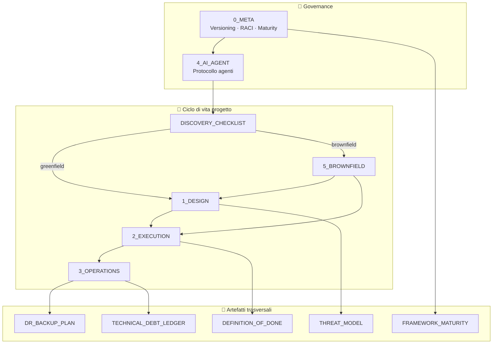
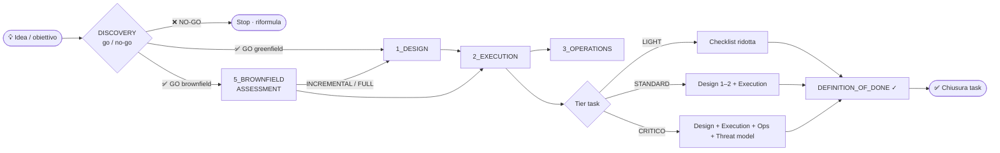
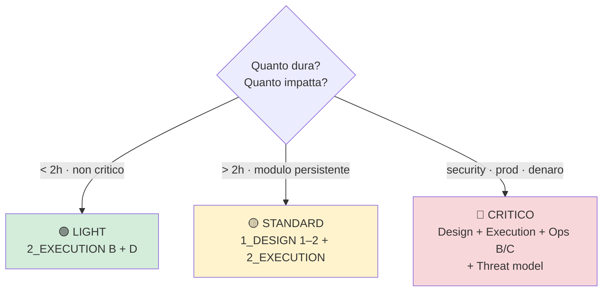
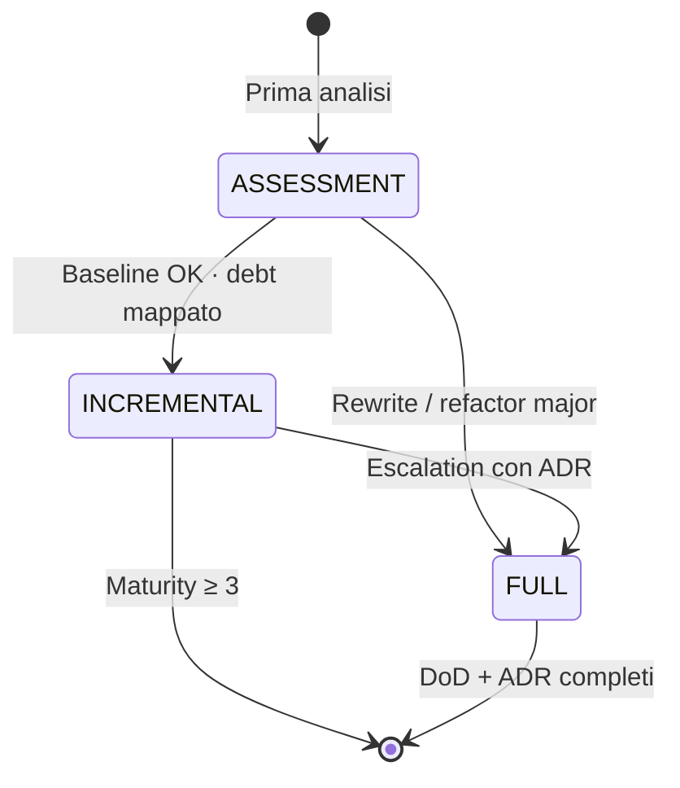

<div align="center">

# 🏗️ Operational Engineering Framework

**Manuale operativo per progettare, eseguire, operare e governare sistemi software** — greenfield e brownfield — con un layer dedicato agli agenti AI.

[](./LICENSE)
[](./0_META_FRAMEWORK.md)
[](#-changelog)
[](./FRAMEWORK_MATURITY.md)

[📖 Inizia qui](#-quick-start) · [🗺️ Mappa documenti](#-framework-operativi) · [🤖 Agenti AI](./AGENTS.md) · [🚨 Runbook](./runbooks/README.md)

</div>

---

## 📋 Indice

- [Cos'è](#-cosè)
- [Per chi è](#-per-chi-è)
- [Architettura del manuale](#-architettura-del-manuale)
- [Flusso operativo](#-flusso-operativo)
- [Framework operativi](#-framework-operativi)
- [Classificazione task](#-classificazione-task)
- [Brownfield](#-brownfield)
- [Artefatti trasversali](#-artefatti-trasversali)
- [Operazioni e incidenti](#-operazioni-e-incidenti)
- [Agenti AI](#-agenti-ai)
- [Quick start](#-quick-start)
- [Struttura repository](#-struttura-repository)
- [Governance e licenza](#-governance-e-licenza)
- [Changelog](#-changelog)

---

## 🎯 Cos'è

Un **set di documenti operativi** — non un tool — che traduce buone pratiche di ingegneria software in checklist, gate, tier e artefatti riutilizzabili.

| Principio | Descrizione |
|-----------|-------------|
| **Dogfooding** | Il manuale si governa con le proprie regole (`0_META`) |
| **Tier-aware** | Ogni task ha un livello di rigore: LIGHT · STANDARD · CRITICO |
| **Path-aware** | Greenfield e brownfield hanno percorsi distinti ma convergono su Execution e Operations |
| **AI-native** | Gli agenti AI seguono un protocollo esplicito (`4_AI_AGENT`) con escalation e DoD |

> 💡 **Non sostituisce** la documentazione del tuo prodotto: fornisce **come** lavorare su design, delivery, ops e legacy in modo coerente.

---

## 👥 Per chi è

| Ruolo | Documenti di ingresso |
|-------|----------------------|
| **Tech lead / architect** | `1_DESIGN` · `5_BROWNFIELD` · ADR |
| **Developer** | `2_EXECUTION` · `DEFINITION_OF_DONE` |
| **SRE / on-call** | `3_OPERATIONS` · `runbooks/` · `DR_BACKUP_PLAN` |
| **Product / stakeholder** | `DISCOVERY_CHECKLIST` · `FRAMEWORK_MATURITY` |
| **Agenti AI (Cursor, ecc.)** | [`AGENTS.md`](./AGENTS.md) → `4_AI_AGENT` |

---

## 🧩 Architettura del manuale



---

## 🔀 Flusso operativo



**Regole di chiusura**

- Ogni task passa da **[DEFINITION_OF_DONE](./DEFINITION_OF_DONE.md)** prima del merge o del deploy.
- Review trimestrale con **[FRAMEWORK_MATURITY](./FRAMEWORK_MATURITY.md)** — target minimo **≥ 3** su produzione con utenti reali.

---

## 📚 Framework operativi

| | Alias | Documento | Ver. | Quando usarlo |
|---|-------|-----------|:----:|---------------|
| 🧭 | `0_META` | [0_META_FRAMEWORK.md](./0_META_FRAMEWORK.md) | **1.5** | Governance del manuale · versioning · maturity · RACI |
| 📐 | `1_DESIGN` | [1_DESIGN_FRAMEWORK.md](./1_DESIGN_FRAMEWORK.md) | **3.1** | Piano tecnico · 9 pilastri · refactor strutturale |
| ⚙️ | `2_EXECUTION` | [2_EXECUTION_FRAMEWORK.md](./2_EXECUTION_FRAMEWORK.md) | **2.1** | Dal piano al rilascio · test · CI · deploy |
| 🛡️ | `3_OPERATIONS` | [3_OPERATIONS_FRAMEWORK.md](./3_OPERATIONS_FRAMEWORK.md) | **1.1** | Post-deploy · incidenti · SLO · debito tecnico |
| 🏚️ | `5_BROWNFIELD` | [5_BROWNFIELD_FRAMEWORK.md](./5_BROWNFIELD_FRAMEWORK.md) | **1.0** | Codebase esistente · assessment · legacy |
| 🤖 | `4_AI_AGENT` | [4_AI_AGENT_FRAMEWORK.md](./4_AI_AGENT_FRAMEWORK.md) | **1.5** | Protocollo obbligatorio per agenti AI |

<details>
<summary><strong>📂 Aree brownfield (5_BROWNFIELD)</strong></summary>

| Area | Focus |
|------|-------|
| **A** | Baseline · inventario · debt ledger |
| **B** | Bottleneck e performance |
| **C** | API boundary backend ↔ frontend |
| **D** | Polyglot rewrite |
| **E** | Legacy fit · integrazione graduale |

</details>

---

## 🏷️ Classificazione task



| Tier | Criteri | Framework richiesto | DoD |
|------|---------|---------------------|-----|
| 🟢 **LIGHT** | < 2 h · nessun impatto critico | `2_EXECUTION` sez. B + D | [DoD LIGHT](./DEFINITION_OF_DONE.md) |
| 🟡 **STANDARD** | > 2 h · modulo persistente | `1_DESIGN` pilastri 1–2 + `2_EXECUTION` | [DoD STANDARD](./DEFINITION_OF_DONE.md) |
| 🔴 **CRITICO** | Security · produzione · dati finanziari | `1_DESIGN` + `2_EXECUTION` + `3_OPERATIONS` B/C | [DoD CRITICO](./DEFINITION_OF_DONE.md) + [Threat model](./security/THREAT_MODEL_TEMPLATE.md) |

> ⚠️ Il tier **CRITICO** non è negoziabile sotto deadline: vedi *Circuit Breaker* in `0_META`.

---

## 🏚️ Brownfield

Tier di adozione per codebase già esistenti:



| Tier | Quando | Output atteso |
|------|--------|---------------|
| **ASSESSMENT** | Prima volta sul repo | Inventario · ledger · go/no-go per area |
| **INCREMENTAL** | Change mirati | DoD STANDARD · runbook parziali |
| **FULL** | Rewrite / boundary breaking | ADR · contract test · DoD CRITICO dove serve |

---

## 📎 Artefatti trasversali

| | Artefatto | Scopo |
|---|-----------|-------|
| 🔍 | [DISCOVERY_CHECKLIST.md](./DISCOVERY_CHECKLIST.md) | Pre-design · metriche · go/no-go |
| ✅ | [DEFINITION_OF_DONE.md](./DEFINITION_OF_DONE.md) | Definition of Done per tier |
| 💾 | [DR_BACKUP_PLAN.md](./DR_BACKUP_PLAN.md) | RTO/RPO · restore drill |
| 📊 | [FRAMEWORK_MATURITY.md](./FRAMEWORK_MATURITY.md) | Score adozione **0–5** per progetto |
| 🔐 | [security/THREAT_MODEL_TEMPLATE.md](./security/THREAT_MODEL_TEMPLATE.md) | STRIDE · obbligatorio tier CRITICO |

### Maturity score (sintesi)

| Livello | Nome | Indicatore |
|:-------:|------|------------|
| 0 | Assente | Nessuna baseline |
| 1 | Consapevole | Discovery / Brownfield A |
| 2 | Baseline | Ledger · ADR · CI base |
| 3 | Incremental | DoD STANDARD · ≥ 3 runbook |
| 4 | Operativo | SLO · drill DR · post-mortem |
| 5 | Maturo | DoD CRITICO · idempotency 4/6+ |

---

## 🚨 Operazioni e incidenti

Collegati a **`3_OPERATIONS`** Area A e **[DR_BACKUP_PLAN](./DR_BACKUP_PLAN.md)**.

### Matrice severità

| Livello | Definizione | TTD | TTR | Esempio |
|---------|-------------|-----|-----|---------|
| **P1** 🔴 | Core down · rischio data loss | ≤ 5 min | ≤ 4 h | DB down · leak credenziali |
| **P2** 🟠 | Degradazione · workaround esiste | ≤ 15 min | ≤ 24 h | API terza offline · error rate |
| **P3** 🟡 | Impatto limitato | ≤ 1 h | best effort | Saturazione risorse non core |

### Runbook disponibili

| Scenario | Sev. | File |
|----------|:----:|------|
| API / servizio terzo offline | P1–P2 | [api-third-party-offline.md](./runbooks/api-third-party-offline.md) |
| Database non raggiungibile | P1 | [database-unreachable.md](./runbooks/database-unreachable.md) |
| Error rate alto post-deploy | P1–P2 | [high-error-rate-post-deploy.md](./runbooks/high-error-rate-post-deploy.md) |
| Saturazione CPU/RAM/disco | P2 | [resource-saturation.md](./runbooks/resource-saturation.md) |
| Credenziale compromessa (sospetta) | P1 | [credential-leak-suspected.md](./runbooks/credential-leak-suspected.md) |

→ Indice completo: **[runbooks/README.md](./runbooks/README.md)**

---

## 🤖 Agenti AI

Per **Cursor** e altri agenti: il punto di ingresso è **[AGENTS.md](./AGENTS.md)**.

```
Passo -1  →  DISCOVERY (zero codice se obiettivo vago)
Passo  0  →  GREENFIELD vs BROWNFIELD
Passo  1  →  Classifica tier + carica solo file pertinenti
Passo  2  →  Esegui checklist · verifica DoD · trace · stop su escalation
```

Protocollo completo: **[4_AI_AGENT_FRAMEWORK.md](./4_AI_AGENT_FRAMEWORK.md)**

---

## 🚀 Quick start

### Nuovo progetto (greenfield)

1. Compila **[DISCOVERY_CHECKLIST](./DISCOVERY_CHECKLIST.md)** → GO
2. Apri **`1_DESIGN`** — pilastri 1–2 minimo
3. Esegui con **`2_EXECUTION`**
4. Attiva **`3_OPERATIONS`** al primo deploy in produzione
5. Valuta maturity trimestrale → target **≥ 3**

### Codebase esistente (brownfield)

1. **[DISCOVERY_CHECKLIST](./DISCOVERY_CHECKLIST.md)** → GO brownfield
2. **`5_BROWNFIELD`** tier **ASSESSMENT**
3. Scegli **INCREMENTAL** o **FULL** in base all'output
4. Convergi su Design → Execution → Operations

### Task rapido (< 2 h)

1. Classifica **LIGHT**
2. Solo **`2_EXECUTION`** sez. B + D
3. Verifica **[DoD LIGHT](./DEFINITION_OF_DONE.md)**

---

## 📁 Struttura repository

```
.
├── 0_META_FRAMEWORK.md          # Governance
├── 1_DESIGN_FRAMEWORK.md        # Design · 9 pilastri
├── 2_EXECUTION_FRAMEWORK.md     # Delivery
├── 3_OPERATIONS_FRAMEWORK.md    # Ops · SLO · incidenti
├── 4_AI_AGENT_FRAMEWORK.md      # Protocollo AI
├── 5_BROWNFIELD_FRAMEWORK.md    # Legacy · assessment
├── AGENTS.md                    # Entry point agenti
├── ADR-000.md · ADR-001.md      # Architecture Decision Records
├── CHANGELOG.md
├── DEFINITION_OF_DONE.md
├── DISCOVERY_CHECKLIST.md
├── DR_BACKUP_PLAN.md
├── FRAMEWORK_MATURITY.md
├── TECHNICAL_DEBT_LEDGER.md
├── runbooks/                    # 5 scenari P1–P3
└── security/
    └── THREAT_MODEL_TEMPLATE.md
```

---

## ⚖️ Governance e licenza

| Documento | Contenuto |
|-----------|-----------|
| [CHANGELOG.md](./CHANGELOG.md) | Storico modifiche al set |
| [ADR-000.md](./ADR-000.md) | Perché 9/6/5 pilastri |
| [ADR-001.md](./ADR-001.md) | Decisione architetturale brownfield |
| [TECHNICAL_DEBT_LEDGER.md](./TECHNICAL_DEBT_LEDGER.md) | Ledger debito tecnico live |
| [LICENSE](./LICENSE) | **MIT** — uso, modifica e distribuzione liberi |

**Prossimo self-audit consigliato:** 2026-10-24 (trimestrale)

---

## 📅 Changelog

**2026-07-24** — Release iniziale pubblica

- Artefatti trasversali: discovery, DoD, DR, maturity, threat model
- `0_META` v1.5 · `4_AI_AGENT` v1.5
- 5 runbook operativi · matrice severità P1/P2/P3

Dettaglio completo → **[CHANGELOG.md](./CHANGELOG.md)**

---

<div align="center">

**Operational Engineering Framework** · [MIT License](./LICENSE)

*Progettato per essere applicato, misurato e migliorato — non solo letto.*

</div>
